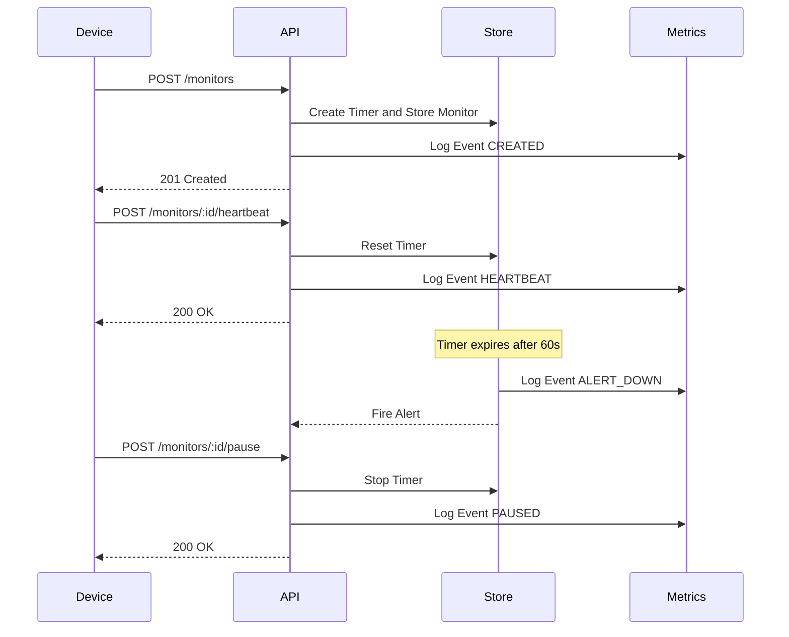

# Pulse-Check-API ("Watchdog" Sentinel)

A Dead Man's Switch API for monitoring critical infrastructure devices. Devices register a "monitor" with a countdown timer. If a device fails to "ping" the API before the timer runs out, the system automatically triggers an alert.

## 1. Architecture Diagram



## 2. Setup Instructions

To get the application running locally, follow these steps:

1. **Install dependencies:**
   ```bash
   npm install
   ```

2. **Run in development mode:**
   ```bash
   npm run dev
   ```
   The server will start on port 3000 (or the port defined in your environment).

3. **Build and start for production:**
   ```bash
   npm run build
   npm start
   ```

4. **Run tests:**
   ```bash
   npm test
   ```

## 3. API Documentation

### Base URL
`http://localhost:3000` (or the configured `PORT`)

### Endpoints

#### 1. Register a Monitor
- **Method:** `POST /monitors`
- **Body:**
  ```json
  {
    "id": "device-123",
    "timeout": 60,
    "alert_email": "admin@critmon.com"
  }
  ```
- **Response:** `201 Created` with monitor details.

#### 2. Send Heartbeat
- **Method:** `POST /monitors/:id/heartbeat`
- **Description:** Resets the countdown timer for the specified device. If the device was paused, this will un-pause it.
- **Response:** `200 OK`

#### 3. Pause Monitor ("Snooze")
- **Method:** `POST /monitors/:id/pause`
- **Description:** Pauses the monitoring. The timer stops completely and no alerts will fire.
- **Response:** `200 OK`

#### 4. Get a Specific Monitor
- **Method:** `GET /monitors/:id`
- **Response:** `200 OK` with monitor state.

#### 5. Get All Monitors
- **Method:** `GET /monitors`
- **Response:** `200 OK` with a list of all monitors.

#### 6. Delete a Monitor
- **Method:** `DELETE /monitors/:id`
- **Response:** `200 OK`

#### 7. Get Metrics Summary
- **Method:** `GET /monitors/metrics`
- **Description:** Retrieves a summary of all events logged by the Metrics Audit System.
- **Response:** `200 OK` with summary data.

## 4. The Developer's Choice: Metrics Audit System

### What was added?
An **Audit Logging / Metrics System** was implemented alongside the core functionality. It records all significant events (such as monitor creation, heartbeats, pauses, deletions, and alerts) into a local CSV file (`metrics_audit.csv`). A new endpoint (`GET /monitors/metrics`) was also added to expose a summary of this historical data.

### Why was it added?
While real-time state is crucial for immediate alerts, historical data is just as important for infrastructure monitoring. By tracking every heartbeat and alert, system operators can:
- **Audit device reliability** over time.
- **Identify intermittent network issues** (e.g., a device missing a heartbeat occasionally but recovering quickly).
- **Maintain a durable log** of events in case the API restarts, preventing the complete loss of historical insights.
